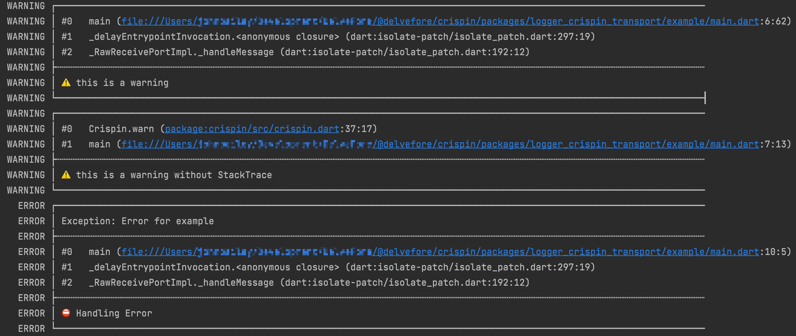

# Crispin Transport for Logger 

[![style: very good analysis][very_good_analysis_badge]][very_good_analysis_link]
[![License: MIT][license_badge]][license_link]
[![melos][melos_badge]][melos_link]

<p style="text-align: center">
  <a href="https://docs.page/delvefore/crispin">Documentation</a> &bull; 
  <a href="https://github.com/DelveFore/crispin/blob/master/packages/crispin/LICENSE">License</a>
</p>

A [Crispin Transport](https://docs.page/delvefore/crispin/transport-logger) for [Logger](https://pub.dev/packages/logger)


## Features
Because [Logger](https://pub.dev/packages/logger) doesn't follow RFC5424 with ascension, `LoggerCrispinTransport` maps log levels as the following:

| [Logger Method](https://pub.dev/documentation/logger/latest/logger/Logger-class.html) | Crispin Method | RFC5424 level | [Logger value](https://pub.dev/documentation/logger/latest/logger/Level.html) |
| :--- | :--- | :--- | :--- |
| `e` | `error` | 0 | 4 |
| `w` | `warn` | 1 | 3 |
| `i` | `info` | 2 | 2 |
| `d` | `debug`| 5 | 1 |
| `v` | `verbose` | 4 | 0 |
| `wtf` / `wtf` | _Not mapped_ | - | 5 |

 
## Getting started

1. Install `flutter pub add logger_crispin_transport` or `dart pub add logger_crispin_transport`
2. Add the transport to Crispin as the below **Usage** section shows

## Usage

```dart
import 'package:crispin/crispin.dart';
import 'package:logger_crispin_transport/logger_crispin_transport.dart';

void main() {
  Crispin().addTransport(LoggerCrispinTransport(LoggerCrispinTransportOptions(level: 'warn')));
}
```

Please see `/example` folder and docs for more examples and please see the docs for more information on usage.



## How To Contribute
1. Create Github issue describing what you'd like to change and use the label `LoggerCrispinTransport` and label either `bug`, `enhancement`, `question`
2. Create your PR with association to the GH Issue (e.g. "closes #4").

## Support 
Create Github issue with the label `LoggerCrispinTransport` and then either `bug`, `enhancement`, `question`.

## Documentation
Please visit us at [Crispin Transport](https://docs.page/delvefore/crispin/transport-logger)


[license_badge]: https://img.shields.io/badge/license-MIT-blue.svg
[license_link]: https://opensource.org/licenses/MIT
[very_good_analysis_badge]: https://img.shields.io/badge/style-very_good_analysis-B22C89.svg
[very_good_analysis_link]: https://pub.dev/packages/very_good_analysis
[melos_badge]: https://img.shields.io/badge/maintained%20with-melos-f700ff.svg?style=flat-square
[melos_link]: https://github.com/invertase/melos